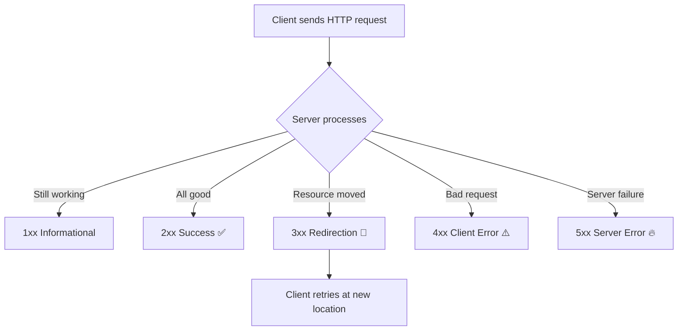
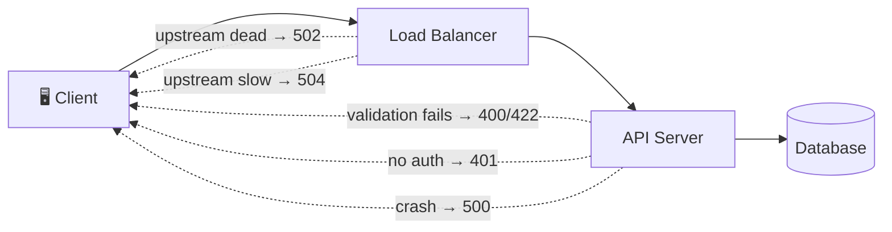
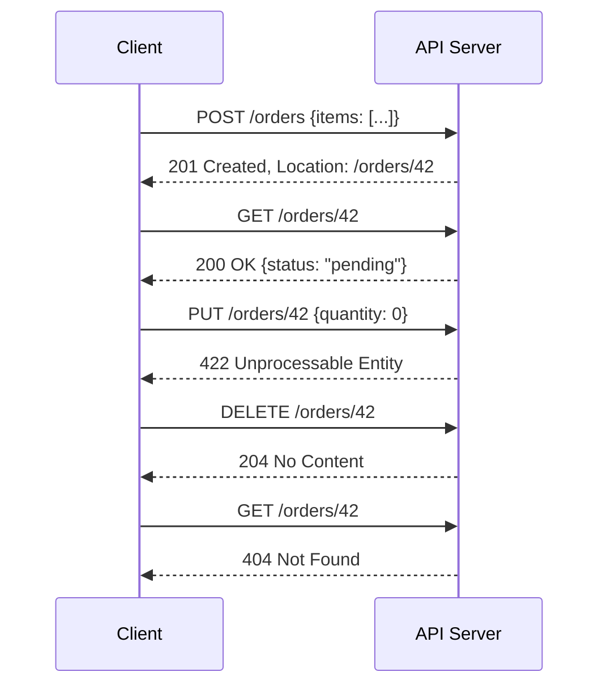

# 🌐 Explain Me: HTTP Status Codes

> **HTTP status codes** are standardized 3-digit numbers returned by a server in response to a client's request, indicating whether the request **succeeded, failed, or needs further action**.

---

## 📚 1. Concept in Detail

### What are HTTP Status Codes?

Every HTTP response starts with a **status line** containing a numeric code and a reason phrase (e.g., `200 OK`, `404 Not Found`). Defined in RFC 9110, these codes let clients (browsers, mobile apps, API consumers) programmatically understand the outcome of a request without parsing the response body.

### 🔑 The Five Classes

The first digit determines the **class** of the response:

| Class | Range | Meaning | Who's "responsible" |
|-------|-------|---------|---------------------|
| **1xx** | 100–199 | ℹ️ Informational — request received, continuing | — |
| **2xx** | 200–299 | ✅ Success — request accepted and processed | — |
| **3xx** | 300–399 | 🔀 Redirection — further action needed | Client follows |
| **4xx** | 400–499 | ⚠️ Client Error — request is invalid | Client |
| **5xx** | 500–599 | 🔥 Server Error — server failed to fulfill valid request | Server |



### ℹ️ 1xx — Informational

| Code | Name | Meaning |
|------|------|---------|
| `100` | Continue | Server received headers; client should send body |
| `101` | Switching Protocols | Upgrading (e.g., HTTP → WebSocket) |
| `103` | Early Hints | Preload resources before final response |

### ✅ 2xx — Success

| Code | Name | Meaning |
|------|------|---------|
| `200` | OK | Standard success (GET returns data, etc.) |
| `201` | Created | New resource created (POST) — include `Location` header |
| `202` | Accepted | Request queued for async processing |
| `204` | No Content | Success, but nothing to return (DELETE, PUT) |
| `206` | Partial Content | Range request (video streaming, resumable downloads) |

### 🔀 3xx — Redirection

| Code | Name | Meaning |
|------|------|---------|
| `301` | Moved Permanently | Resource has a new permanent URL (SEO-friendly) |
| `302` | Found | Temporary redirect (method may change to GET) |
| `304` | Not Modified | Cached version is still valid (conditional GET) |
| `307` | Temporary Redirect | Like 302 but method/body preserved |
| `308` | Permanent Redirect | Like 301 but method/body preserved |

### ⚠️ 4xx — Client Errors

| Code | Name | Meaning |
|------|------|---------|
| `400` | Bad Request | Malformed syntax, invalid JSON, validation failure |
| `401` | Unauthorized | Not authenticated (missing/invalid credentials) |
| `403` | Forbidden | Authenticated but **not allowed** |
| `404` | Not Found | Resource doesn't exist |
| `405` | Method Not Allowed | e.g., POST to a GET-only endpoint |
| `409` | Conflict | State conflict (duplicate entry, edit collision) |
| `410` | Gone | Resource permanently deleted |
| `422` | Unprocessable Entity | Valid syntax, but semantic validation failed |
| `429` | Too Many Requests | Rate limit exceeded — check `Retry-After` header |

> 💡 **401 vs 403**: `401` = "Who are you? Log in first." `403` = "I know who you are, and you still can't do this."

### 🔥 5xx — Server Errors

| Code | Name | Meaning |
|------|------|---------|
| `500` | Internal Server Error | Unhandled exception, generic failure |
| `501` | Not Implemented | Server doesn't support the request method |
| `502` | Bad Gateway | Proxy/load balancer got invalid response from upstream |
| `503` | Service Unavailable | Overloaded or down for maintenance |
| `504` | Gateway Timeout | Upstream server didn't respond in time |

### Where Codes Appear in the Stack



---

## 🛠️ 2. How to Implement

### FastAPI (Python)

```python
from fastapi import FastAPI, HTTPException, status
from pydantic import BaseModel

app = FastAPI()
db: dict[int, dict] = {}

class Item(BaseModel):
    name: str
    price: float

# 201 Created for successful POST
@app.post("/items/{item_id}", status_code=status.HTTP_201_CREATED)
async def create_item(item_id: int, item: Item):
    if item_id in db:
        # 409 Conflict for duplicates
        raise HTTPException(status_code=409, detail="Item already exists")
    db[item_id] = item.model_dump()
    return db[item_id]

@app.get("/items/{item_id}")
async def get_item(item_id: int):
    if item_id not in db:
        # 404 Not Found
        raise HTTPException(status_code=404, detail="Item not found")
    return db[item_id]  # 200 OK by default

# 204 No Content for DELETE
@app.delete("/items/{item_id}", status_code=status.HTTP_204_NO_CONTENT)
async def delete_item(item_id: int):
    if item_id not in db:
        raise HTTPException(status_code=404, detail="Item not found")
    del db[item_id]
```

### Express.js (Node.js)

```javascript
const express = require("express");
const app = express();
app.use(express.json());

app.post("/users", (req, res) => {
  if (!req.body.email) {
    return res.status(400).json({ error: "email is required" });
  }
  const user = createUser(req.body);
  res.status(201).location(`/users/${user.id}`).json(user);
});

app.get("/admin", (req, res) => {
  if (!req.headers.authorization) return res.status(401).json({ error: "Login required" });
  if (!isAdmin(req)) return res.status(403).json({ error: "Admins only" });
  res.status(200).json({ secret: "data" });
});

// Global error handler → 500
app.use((err, req, res, next) => {
  console.error(err);
  res.status(500).json({ error: "Internal server error" });
});
```

### Handling Status Codes as a Client (Python)

```python
import requests
import time

def fetch_with_retry(url: str, max_retries: int = 3):
    for attempt in range(max_retries):
        response = requests.get(url)

        if response.status_code == 200:
            return response.json()
        elif response.status_code == 404:
            raise ValueError(f"Resource not found: {url}")
        elif response.status_code == 401:
            raise PermissionError("Authentication required")
        elif response.status_code == 429:
            # Respect rate limits
            wait = int(response.headers.get("Retry-After", 5))
            time.sleep(wait)
        elif response.status_code >= 500:
            # Server errors are retryable with backoff
            time.sleep(2 ** attempt)
        else:
            response.raise_for_status()

    raise RuntimeError(f"Failed after {max_retries} retries")
```

---

## 💡 3. Examples

### Example: REST API Lifecycle



### Example: Choosing the Right Code

| Scenario | Correct Code | Common Mistake |
|----------|-------------|----------------|
| POST creates a resource | `201 Created` | Returning `200` |
| DELETE succeeds | `204 No Content` | Returning `200` with empty body |
| Invalid JSON in body | `400 Bad Request` | Returning `500` |
| Valid JSON, fails business rule | `422 Unprocessable Entity` | Returning `400` for everything |
| Missing API key | `401 Unauthorized` | Returning `403` |
| Valid key, insufficient permission | `403 Forbidden` | Returning `401` |
| Rate limit hit | `429 Too Many Requests` | Returning `503` |
| Async job accepted | `202 Accepted` | Returning `200` immediately |

### Example: Caching with 304

```
GET /logo.png
If-None-Match: "abc123"

HTTP/1.1 304 Not Modified      ← body omitted, browser uses cache
ETag: "abc123"
```

### Example: curl to Inspect Status Codes

```bash
# Show only the status code
curl -s -o /dev/null -w "%{http_code}\n" https://example.com

# Follow redirects and show each hop
curl -sIL https://example.com | grep HTTP
```

---

## ✅ 4. Advantages and Requirements

### Advantages of Using Correct Status Codes

| Advantage | Details |
|-----------|---------|
| 🤝 **Interoperability** | Any client understands the outcome without custom conventions |
| 🔁 **Smart retries** | Clients retry `5xx`/`429` but not `4xx` — saving traffic |
| 🗄️ **Caching** | `304`, `Cache-Control` + codes drive browser/CDN caching |
| 🔍 **Debuggability** | Logs and monitoring dashboards group errors by class |
| 📈 **SEO** | `301` transfers page rank; `404`/`410` de-index correctly |
| 🛠️ **Tooling** | Load balancers, API gateways route/alert based on codes |

### 📋 Requirements for Proper Usage

- **Return the most specific code** — prefer `422` over generic `400` when validation fails semantically
- **Never return `200` with an error body** — breaks clients and monitoring
- **Include helpful bodies with errors** — e.g., RFC 7807 Problem Details:

```json
{
  "type": "https://api.example.com/errors/insufficient-funds",
  "title": "Insufficient funds",
  "status": 403,
  "detail": "Your balance is $30, but the transfer requires $50."
}
```

- **Set required headers**: `Location` with `201`/`3xx`, `Retry-After` with `429`/`503`, `Allow` with `405`
- **Don't leak internals in 5xx** — log the stack trace server-side, return a generic message
- **Document your API's codes** — OpenAPI/Swagger specs should list possible responses per endpoint

---

## 🧠 Quick Mnemonic

> **1xx** — "Hold on" ⏳  
> **2xx** — "Here you go" ✅  
> **3xx** — "Go over there" 👉  
> **4xx** — "You messed up" ⚠️  
> **5xx** — "I messed up" 🔥

---

## 🔗 Quick Reference

| Item | Value |
|------|-------|
| Spec | RFC 9110 (HTTP Semantics) |
| Full list | https://developer.mozilla.org/en-US/docs/Web/HTTP/Status |
| Problem Details | RFC 7807 / RFC 9457 |
| Fun | https://http.cat (status codes as cat pictures 🐱) |
