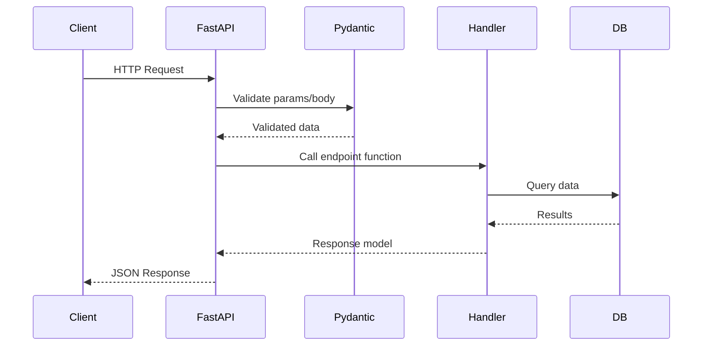
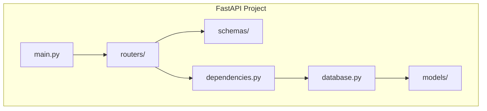

# ⚡ Explain Me: FastAPI

> **FastAPI** is a modern, high-performance **Python web framework** for building APIs with automatic validation, documentation, and async support.

---

## 📚 1. Concept in Detail

### What is FastAPI?

FastAPI is a Python framework built on **Starlette** (web) and **Pydantic** (validation). It provides automatic OpenAPI/Swagger docs, type-hint-based request validation, and native async support — making it one of the fastest Python frameworks available.

### 🔑 Important Related Concepts

| Concept | Description |
|---------|-------------|
| **Pydantic Models** | Data validation and serialization via type hints |
| **Path Parameters** | URL segments like `/users/{user_id}` |
| **Query Parameters** | URL query strings like `?page=1&limit=10` |
| **Request Body** | JSON/form data validated against Pydantic models |
| **Dependency Injection** | Reusable components (DB sessions, auth) |
| **Async/Await** | Non-blocking I/O for high concurrency |
| **OpenAPI / Swagger** | Auto-generated API documentation at `/docs` |
| **Middleware** | CORS, authentication, logging layers |
| **Background Tasks** | Run tasks after sending response |
| **WebSockets** | Real-time bidirectional communication |
| **APIRouter** | Modular route organization |

### Request Lifecycle



---

## 🛠️ 2. How to Implement

### Installation

```bash
pip install fastapi uvicorn[standard]
```

### Basic API

```python
from fastapi import FastAPI
from pydantic import BaseModel

app = FastAPI(title="My API", version="1.0.0")

class Item(BaseModel):
    name: str
    price: float
    in_stock: bool = True

@app.get("/")
async def root():
    return {"message": "Hello, FastAPI!"}

@app.get("/items/{item_id}")
async def get_item(item_id: int, q: str | None = None):
    return {"item_id": item_id, "query": q}

@app.post("/items", status_code=201)
async def create_item(item: Item):
    return {"created": item}
```

### Run Server

```bash
uvicorn main:app --reload --host 0.0.0.0 --port 8000
# Docs at http://localhost:8000/docs
```

### Dependency Injection

```python
from fastapi import Depends, HTTPException
from sqlalchemy.orm import Session

def get_db():
    db = SessionLocal()
    try:
        yield db
    finally:
        db.close()

@app.get("/users/{user_id}")
async def get_user(user_id: int, db: Session = Depends(get_db)):
    user = db.query(User).filter(User.id == user_id).first()
    if not user:
        raise HTTPException(status_code=404, detail="User not found")
    return user
```

### Authentication

```python
from fastapi import Depends, HTTPException
from fastapi.security import OAuth2PasswordBearer
import jwt

oauth2_scheme = OAuth2PasswordBearer(tokenUrl="token")

async def get_current_user(token: str = Depends(oauth2_scheme)):
    try:
        payload = jwt.decode(token, SECRET_KEY, algorithms=["HS256"])
        return payload["sub"]
    except jwt.PyJWTError:
        raise HTTPException(status_code=401, detail="Invalid token")

@app.get("/protected")
async def protected_route(user: str = Depends(get_current_user)):
    return {"user": user}
```

### APIRouter (Modular)

```python
# routers/users.py
from fastapi import APIRouter

router = APIRouter(prefix="/users", tags=["users"])

@router.get("/")
async def list_users():
    return [{"id": 1, "name": "Alice"}]

# main.py
from routers import users
app.include_router(users.router)
```

---

## 💡 3. Examples

### Example: CRUD API with Database

```python
from fastapi import FastAPI, HTTPException
from pydantic import BaseModel
from typing import List

app = FastAPI()
db: dict[int, dict] = {}
counter = 0

class UserCreate(BaseModel):
    name: str
    email: str

class User(UserCreate):
    id: int

@app.post("/users", response_model=User, status_code=201)
async def create_user(user: UserCreate):
    global counter
    counter += 1
    db[counter] = {"id": counter, **user.model_dump()}
    return db[counter]

@app.get("/users", response_model=List[User])
async def list_users(skip: int = 0, limit: int = 10):
    return list(db.values())[skip : skip + limit]

@app.delete("/users/{user_id}", status_code=204)
async def delete_user(user_id: int):
    if user_id not in db:
        raise HTTPException(status_code=404, detail="User not found")
    del db[user_id]
```

### Example: WebSocket

```python
from fastapi import WebSocket

@app.websocket("/ws/chat")
async def websocket_endpoint(websocket: WebSocket):
    await websocket.accept()
    while True:
        data = await websocket.receive_text()
        await websocket.send_text(f"Echo: {data}")
```

### Example: Background Tasks

```python
from fastapi import BackgroundTasks

def send_email(email: str, message: str):
    # Send email asynchronously
    pass

@app.post("/notify")
async def notify(email: str, bg: BackgroundTasks):
    bg.add_task(send_email, email, "Welcome!")
    return {"status": "notification queued"}
```

### Project Structure



---

## ✅ 4. Advantages

| Advantage | Details |
|-----------|---------|
| ⚡ **Very fast** | One of the fastest Python frameworks (on par with Node.js) |
| 📝 **Auto docs** | Swagger UI and ReDoc generated automatically |
| ✅ **Type validation** | Pydantic catches errors before they reach your code |
| 🔄 **Async native** | Built for async/await from the ground up |
| 🧩 **Modular** | APIRouter, dependency injection, middleware |
| 📖 **Great docs** | Excellent official documentation and tutorials |
| 🌐 **Standards-based** | OpenAPI, JSON Schema, OAuth2 |

### 📋 Requirements

- **Python 3.8+** (3.10+ recommended)
- `pip install fastapi uvicorn[standard]`
- ASGI server: **Uvicorn** (dev) or **Gunicorn + Uvicorn** (production)
- Optional: SQLAlchemy, Alembic, Pydantic v2
- For production: reverse proxy (Nginx), HTTPS, process manager

---

## 🆚 FastAPI vs Flask vs Django REST

| Feature | FastAPI | Flask | Django REST |
|---------|---------|-------|-------------|
| Speed | ⚡⚡⚡ | ⚡⚡ | ⚡ |
| Auto validation | ✅ Pydantic | ❌ Manual | ✅ Serializers |
| Auto docs | ✅ Swagger | ❌ | ⚠️ drf-spectacular |
| Async | ✅ Native | ⚠️ Limited | ⚠️ Limited |
| Learning curve | Low | Low | Medium |
| Best for | Modern APIs | Simple APIs | Full-stack apps |

---

## 🔗 Quick Reference

| Item | Value |
|------|-------|
| Website | https://fastapi.tiangolo.com |
| Docs UI | `/docs` (Swagger), `/redoc` (ReDoc) |
| Install | `pip install fastapi uvicorn` |
