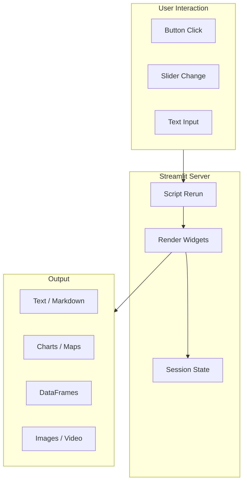
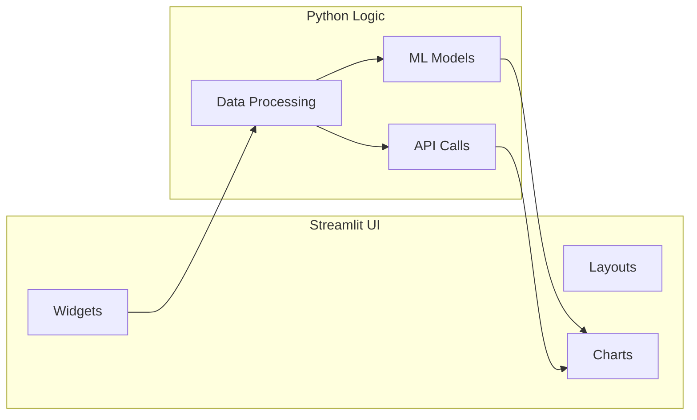

# 📊 Streamlit

> **Streamlit** is an open-source **Python framework** for building interactive data apps and ML dashboards with pure Python — no HTML, CSS, or JavaScript required.

---

## 📚 1. Concept in Detail

### What is Streamlit?

Streamlit turns Python scripts into shareable web apps. Write your logic with `st.write()`, `st.button()`, `st.chart()` and Streamlit handles the UI rendering, state management, and deployment — ideal for data science prototypes and internal tools.

### 🔑 Important Related Concepts

| Concept | Description |
|---------|-------------|
| **Widgets** | Interactive UI elements (sliders, buttons, inputs) |
| **Session State** | Persist data across reruns (`st.session_state`) |
| **Rerun Model** | Script reruns top-to-bottom on every interaction |
| **Caching** | `@st.cache_data` and `@st.cache_resource` for performance |
| **Layouts** | Columns, tabs, expanders, sidebars |
| **Charts** | Built-in support for Matplotlib, Plotly, Altair |
| **File Upload** | `st.file_uploader` for CSV, images, etc. |
| **Multi-page Apps** | `st.navigation` / `pages/` directory |
| **Streamlit Cloud** | Free hosting at share.streamlit.io |
| **Components** | Custom HTML/JS widgets via `st.components` |

### How Streamlit Works



---

## 🛠️ 2. How to Implement

### Installation

```bash
pip install streamlit pandas matplotlib
```

### Basic App

```python
import streamlit as st
import pandas as pd
import numpy as np

st.set_page_config(page_title="My Dashboard", layout="wide")

st.title("📊 Sales Dashboard")
st.write("Interactive data exploration app")

# Sidebar controls
st.sidebar.header("Filters")
region = st.sidebar.selectbox("Region", ["All", "North", "South", "East", "West"])
date_range = st.sidebar.date_input("Date Range", [])

# Generate sample data
data = pd.DataFrame({
    "date": pd.date_range("2026-01-01", periods=100),
    "sales": np.random.randint(1000, 5000, 100),
    "region": np.random.choice(["North", "South", "East", "West"], 100)
})

if region != "All":
    data = data[data["region"] == region]

# Display metrics
col1, col2, col3 = st.columns(3)
col1.metric("Total Sales", f"${data['sales'].sum():,}")
col2.metric("Avg Daily", f"${data['sales'].mean():,.0f}")
col3.metric("Records", len(data))

# Chart
st.line_chart(data.set_index("date")["sales"])
st.dataframe(data, use_container_width=True)
```

### Run App

```bash
streamlit run app.py
# Opens at http://localhost:8501
```

### Session State

```python
import streamlit as st

if "count" not in st.session_state:
    st.session_state.count = 0

if st.button("Increment"):
    st.session_state.count += 1

st.write(f"Count: {st.session_state.count}")
```

### Caching

```python
@st.cache_data
def load_data(file_path: str) -> pd.DataFrame:
    return pd.read_csv(file_path)

@st.cache_resource
def load_model():
    return joblib.load("model.pkl")
```

### File Upload + Processing

```python
uploaded = st.file_uploader("Upload CSV", type=["csv"])

if uploaded:
    df = pd.read_csv(uploaded)
    st.write(f"Loaded {len(df)} rows")
    st.dataframe(df.head())

    if st.button("Generate Summary"):
        st.write(df.describe())
```

### Multi-Page App

```
my_app/
├── app.py          # Main entry with navigation
├── pages/
│   ├── 1_📊_Dashboard.py
│   ├── 2_🔍_Explorer.py
│   └── 3_⚙️_Settings.py
```

```python
# app.py
import streamlit as st

pg = st.navigation([
    st.Page("pages/1_📊_Dashboard.py", title="Dashboard"),
    st.Page("pages/2_🔍_Explorer.py", title="Explorer"),
    st.Page("pages/3_⚙️_Settings.py", title="Settings"),
])
pg.run()
```

---

## 💡 3. Examples

### Example: ML Model Demo

```python
import streamlit as st
import joblib
import pandas as pd

model = joblib.load("classifier.pkl")

st.title("🤖 Iris Classifier")

sepal_l = st.slider("Sepal Length", 4.0, 8.0, 5.5)
sepal_w = st.slider("Sepal Width", 2.0, 5.0, 3.5)
petal_l = st.slider("Petal Length", 1.0, 7.0, 4.0)
petal_w = st.slider("Petal Width", 0.5, 3.0, 1.5)

if st.button("Predict"):
    features = pd.DataFrame([[sepal_l, sepal_w, petal_l, petal_w]])
    prediction = model.predict(features)[0]
    st.success(f"Prediction: **{prediction}**")
```

### Example: Chat Interface

```python
import streamlit as st

st.title("💬 AI Chat")

if "messages" not in st.session_state:
    st.session_state.messages = []

for msg in st.session_state.messages:
    with st.chat_message(msg["role"]):
        st.write(msg["content"])

if prompt := st.chat_input("Ask something..."):
    st.session_state.messages.append({"role": "user", "content": prompt})
    with st.chat_message("user"):
        st.write(prompt)

    response = f"You asked: {prompt}"  # Replace with LLM call
    st.session_state.messages.append({"role": "assistant", "content": response})
    with st.chat_message("assistant"):
        st.write(response)
```

### App Architecture



---

## ✅ 4. Advantages

| Advantage | Details |
|-----------|---------|
| 🐍 **Pure Python** | No HTML/CSS/JS needed |
| ⚡ **Rapid prototyping** | Dashboard in minutes |
| 📊 **Data-native** | Pandas, NumPy, Plotly integration |
| 🔄 **Interactive** | Widgets update in real time |
| ☁️ **Free hosting** | Streamlit Community Cloud |
| 🧩 **Extensible** | Custom components, plugins |
| 👥 **Shareable** | One URL to share with team |

### 📋 Requirements

- **Python 3.8+**
- `pip install streamlit`
- For charts: `matplotlib`, `plotly`, or `altair`
- For ML demos: `scikit-learn`, `pandas`, etc.
- For deployment: GitHub repo + Streamlit Cloud account
- For production: Docker, Kubernetes, or cloud VM

---

## 🆚 Streamlit vs Gradio vs Dash

| Feature | Streamlit | Gradio | Dash |
|---------|-----------|--------|------|
| Focus | Data apps | ML demos | Dashboards |
| Language | Python | Python | Python + JS |
| Learning curve | Very low | Very low | Medium |
| Customization | Medium | Low | High |
| Best for | Data science UIs | Model sharing | Enterprise dashboards |

---

## 🔗 Quick Reference

| Item | Value |
|------|-------|
| Website | https://streamlit.io |
| Docs | https://docs.streamlit.io |
| Default Port | 8501 |
| Install | `pip install streamlit` |
